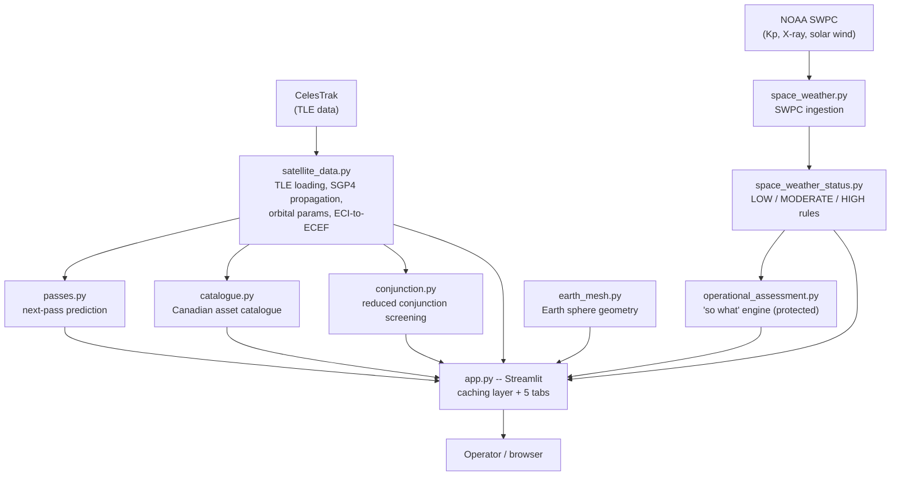

# Space Operations Dashboard

A public-data space domain awareness tool: a Streamlit dashboard that turns live satellite tracking, pass prediction, space weather, a Canadian space-asset catalogue, and reduced conjunction screening into a single operator-facing view of "what is happening in the space domain right now, and how can someone reading this understand it quickly." Built as a 28-day solo project by a mechanical engineering student, to demonstrate space-operations thinking (data to system to environment to operational impact), not just coding.

## What this is, and isn't

This is a **public-data educational prototype**, built entirely from free, no-auth data sources (CelesTrak for orbital elements, NOAA SWPC for space weather). It is not a real military, intelligence, or operational CAF/3 Canadian Space Division system, and nothing on the dashboard, in this README, or in any accompanying report or presentation should be read as claiming otherwise.

Two specific features carry their own limitations that are worth stating up front rather than leaving implicit:

* **Conjunction screening** (`conjunction.py`, the Conjunction Screening tab) is a simplified screening heuristic on public two-line-element data, not a certified collision-probability (Pc) system. Public TLEs carry no usable covariance information, so a real Pc calculation is not possible from this data -- that is a fact about the input data, not a shortcoming of the code, and saying so explicitly is meant as a credibility feature. The tab exposes its own screening parameters (margin, time window, step size) as sliders specifically so the grid-sampling limitation (a fast, close crossing could fall entirely between two time samples) is demonstrable, not just asserted in disclaimer text.
* **Space weather assessment** (`operational_assessment.py`, the Space Weather tab) is a simplified educational/operational assessment built from rule-based thresholds against NOAA's own published scales, not a real space-weather warning system.

Both tabs carry an on-screen disclaimer restating this. See "Real Findings Worth Remembering" and "Open Items" below for the full, honest list of what this project does and doesn't handle.

## Features

* **Live satellite tracking** -- TLEs loaded and propagated with Skyfield/SGP4, subpoints plotted on a 2D map or a true-altitude 3D globe, with search/select and live altitude/inclination/period/speed.
* **Next-pass prediction** -- rise/culminate/set times, duration, and max elevation for any tracked satellite over five Canadian sites (Ottawa, Halifax, Edmonton, Vancouver, Yellowknife), with a static-visibility fallback for GEO satellites that never cross the pass-detection threshold.
* **Canadian asset catalogue** -- a curated, filterable table of Canadian space assets (RADARSAT-2, the RADARSAT Constellation Mission, Sapphire, NEOSSat, SCISAT, Anik/Telesat comms, and more), each with mission, operator, orbit, purpose, and launch date. Sapphire, Canada's dedicated space-surveillance satellite, is called out specifically.
* **Space weather + operational assessment** -- NOAA SWPC data (Kp index, GOES X-ray flux, real-time solar wind) reduced to a LOW/MODERATE/HIGH status with a plain-language "so what" for GNSS, HF radio, and satellite operations.
* **Reduced conjunction screening** -- pick any Canadian catalogue satellite as the primary asset, screen it against the full tracked population with an altitude-band filter followed by minimum-separation propagation, and get a worst-case risk banner plus a sortable results table.

## Setup and running it

```bash
pip install -r requirements.txt
streamlit run app.py
```

No API keys or accounts needed -- both CelesTrak and NOAA SWPC are free and unauthenticated. First launch fetches and locally caches TLE data; subsequent launches reuse the cache until it's cleared or explicitly reloaded. Requires Streamlit 1.37 or newer (see `requirements.txt` for why).

## Architecture



Every module below `app.py` is plain Python with no Streamlit dependency, so each one can be imported, unit-tested (`test_*.py`), or run standalone (`globe.py`) with no Streamlit runtime involved. `app.py` is the only place that owns caching, live-refresh fragments, and page layout. See "Current Architecture" further down for a per-module description of what each file does and why it's shaped the way it is, and the Progress Log below for the day-by-day reasoning behind each design decision.

## Progress Log

This log tracks daily progress on the Space Operations Dashboard, a public data space domain awareness prototype built as a 28 day solo project. Each entry explains what was built that day, why it was built that way, and what problem (technical or operational) it solved. See the project instructions for the full schedule and scope.

Days 1 through 24 are complete, verified against live network access, committed, and pushed. Day 25 (this entry) covers polish: pulling the README into a coherent whole for a first-time reader, closing the remaining docstring gaps, and adding the architecture diagram above.

### Day 1: First live satellite position

`iss_position.py` loads the International Space Station's TLE (Two Line Element set, the standard format for describing a satellite's orbit) from CelesTrak's "stations" group, then uses Skyfield's timescale and `wgs84.subpoint` to print its current latitude, longitude, and altitude. This was the first working script in the project. It proved out the basic pipeline (fetch a TLE, propagate it to the current time, convert the result to a ground position) that every later feature builds on.

### Day 2 and 3: Tracking many satellites at once

`load_satellites.py` loads CelesTrak's "visual" group in bulk (157 satellites), then builds a Pandas dataframe with each satellite's subpoint (latitude, longitude, altitude), orbital inclination, orbital period, and instantaneous speed. This is where the project moved from tracking a single object to tracking a population, which is a prerequisite for the map, the catalogue, and the pass prediction features that came later.

### Day 4: First map

`plot_map.py` plots the subpoints of the full "visual" group on a Plotly `scattergeo` map, with RADARSAT-2 highlighted as a distinct marker. The goal was to confirm that a single Canadian asset could be visually picked out of a general population of tracked objects, since that distinction (this is one of ours, versus this is generic background traffic) is central to the operator use case the dashboard is meant to support.

### Day 5: Ground tracks

`ground_track.py` plots RADARSAT-2's ground track, meaning its path of subpoints over time rather than a single snapshot, across the next 100 minutes (roughly one full orbit). This required propagating the satellite across a time window instead of evaluating it at one instant, which is a different kind of calculation from Day 4's map.

### Day 6: Refactor into a shared data module

By Day 5, TLE loading and subpoint and orbital parameter logic was duplicated across several standalone scripts. Day 6 consolidated that logic into one shared module, `satellite_data.py`, exposing `load_tle_group`, `get_satellite_by_catnr`, `compute_subpoints`, `compute_ground_track`, and `compute_orbital_params`. Every script and app screen written after this point imports from `satellite_data.py` instead of re-deriving the same math. One lesson documented in this module: `get_satellite_by_catnr` falls back to fetching a satellite individually by its NORAD catalog number if it is not found in the group already loaded, because some assets (RADARSAT-2 among them) are not members of every named CelesTrak group.

### Day 7: Seed the Canadian asset catalogue

This day created `data/canadian_assets.csv`, a curated catalogue of nine Canadian space assets: RADARSAT-2, RCM-1, RCM-2, RCM-3, Sapphire, NEOSSat, SCISAT-1, Anik F2, and Anik F3. Each row records NORAD catalog number, COSPAR ID, operator, category, orbit regime, altitude, inclination, launch date, status, and purpose. This static reference data became the foundation for the catalogue feature integrated on Day 12.

### Day 8: First Streamlit app

This day wrapped the existing map in a minimal Streamlit web app, `app.py`, adding a dropdown (selectbox) to choose a satellite, a live map rendered with `st.plotly_chart`, and a first set of orbital parameter metrics displayed alongside it. This was the point where the project became an interactive dashboard rather than a collection of standalone scripts.

### Day 9: Search, filtering, and staleness warnings

`app.py` was extended with a text search box to filter the satellite dropdown by name, an altitude based classifier that labels each satellite's orbit regime as LEO, MEO, or GEO, and a staleness warning that flags a satellite's position as potentially degraded if its TLE is more than three days old. The staleness warning matters operationally: SGP4 propagation accuracy degrades the further you evaluate it past the TLE's own epoch, so a stale TLE is a real, visible caveat rather than a cosmetic detail.

### Day 10: Pass prediction, part one

`pass_prediction.py` computed topocentric rise, culminate, and set times for RADARSAT-2 over Ottawa, using Skyfield's `find_events` combined with altitude and azimuth (altaz) geometry. This is a different kind of calculation from the map and ground track work: it answers "when is this satellite visible from a specific point on the ground," rather than "where is this satellite right now." The result was checked against a live TLE: pass spacing matched RADARSAT-2's roughly 100.7 minute sun synchronous orbital period, and pass duration scaled with maximum elevation as the underlying geometry predicts.

### Day 11: Pass prediction, part two

Pass prediction was generalized from one hardcoded city into an importable module, `passes.py`, covering five Canadian cities: Ottawa, Halifax, Edmonton, Vancouver, and Yellowknife. This was wired into `app.py` as a "Next Passes" section with a city selector, a slider for how many passes to show, and a results table. This day also fixed a subtle inconsistency: `app.py` had been creating its own separate Skyfield `Timescale` object instead of using the one already shared by `satellite_data.py` and `passes.py`. This was not a correctness bug (two `Timescale` instances agree numerically, since they use the same leap second data), but it meant the app had two independent sources of "now" in one codebase, which is exactly the kind of inconsistency that could cause real problems once autorefresh and caching are introduced later in the project.

### Day 12: Integrate the Canadian asset catalogue

`catalogue.py` integrated the Day 7 catalogue CSV into the app in two ways: as a filterable reference table, and as a set of live, trackable satellites merged into the same selectable pool as the CelesTrak "visual" group. Fetching each of the nine catalogue satellites individually would mean nine separate network requests, so `catalogue.py` bulk fetches CelesTrak's "active" group first in a single request, and only falls back to an individual request for any satellite not found there. See Real Findings below for how much this actually saved and what data quality issue it surfaced.

### Day 13: Buffer, debugging, and layout cleanup

This was a scheduled buffer day, focused on cleanup rather than new features. `app.py` was restructured from one long vertical scroll of sections into three tabs (Map, Canadian Asset Catalogue, and Next Passes), with satellite search, selection, and orbital parameter metrics kept above the tabs since they drive the content shown in all three. A planned sidebar redesign was deliberately skipped to keep this a light cleanup day rather than a full interface rewrite; see Open Items below. While reviewing the code for this day, a real operational bug was caught and fixed. It is described in full under Real Findings.

### Day 14: Midpoint checkpoint

This was the project's scheduled midpoint checkpoint: an end to end test of the running app, the first set of screenshots, and a commit marking the halfway point. The test worked through every feature in order: satellite search and selection, the map, the catalogue filter, and both branches of the Next Passes tab (a normal LEO satellite and a GEO satellite). All four passed without errors, including the specific regression check for the Day 12 filter bug (filtering the catalogue to "EO" only and confirming RCM-1, RCM-2, and RCM-3 still appear, since their category tag is "EO/Defence") and the specific check for the Day 13 GEO fix (selecting Anik F2 and confirming it reports continuous visibility from Ottawa instead of an empty pass table). Five screenshots were captured and saved to `docs/screenshots/`, covering the map, the catalogue filter regression case, a normal LEO pass table, and the GEO status message in both its map and Next Passes views. These are early, functional screenshots meant to document that the app works end to end at the halfway point. Polished, final screenshots for the report and presentation come later, on Day 28.

### Day 15: NOAA space weather ingestion

This day started Week 3 by connecting the app to NOAA's Space Weather Prediction Center (SWPC), which publishes real time space weather data as free JSON feeds with no authentication required. A new module, `space_weather.py`, pulls three products: the planetary Kp index (a one minute cadence nowcast of global geomagnetic activity on the standard 0 to 9 scale), GOES X-ray flux (classified into the standard A, B, C, M, X solar flare scale using the long wavelength, 0.1 to 0.8 nanometer, channel), and real time solar wind (proton speed and density, plus the interplanetary magnetic field, most importantly its Bz component). This was wired into `app.py` as a fourth tab, Space Weather, showing current readings as metrics and a short time series chart for each. The project instructions call Day 16 (the LOW/MODERATE/HIGH status banner) and Day 17 (the operational "so what" assessment) out as the next two days, so today deliberately stopped at ingestion and display. Adding any classification logic now would only mean redoing it properly two days later.

Before writing any code, the current SWPC endpoint URLs were verified directly rather than assumed from memory or from this project's own tech stack notes, exactly as the project's guidance to verify endpoints before coding against them recommends. That check turned up something real: the solar wind endpoints this project's tech stack notes assumed (`products/solar-wind/plasma-*.json` and `mag-*.json`) were deprecated by NOAA in April 2026 (NOAA Service Change Notice 26-21) and replaced with `json/rtsw/rtsw_wind_1m.json` and `json/rtsw/rtsw_mag_1m.json`, which also renamed several fields, for example "density" became "proton_density" and "lon_gsm" became "phi_gsm". The old endpoints were confirmed to return a 404 error before any code was written against them. Had the original endpoint names been used instead, on the assumption that space weather API documentation from earlier in the project was still current, the feature would have silently failed the first time it ran against live data. This is a concrete example of exactly the kind of verification the project's own guidance calls for, not a hypothetical one.

A second, smaller finding from this day: the real time solar wind feeds report from two separate instruments (a primary, currently called SOLAR1, and a backup, ACE) at overlapping timestamps, with an `active` flag marking which one NOAA is currently treating as authoritative. Early inspection of a raw sample showed that without filtering to the active source only, speed, density, and magnetic field readings would appear to jump around from one minute to the next, since the two instruments do not report identical values for the same moment. `space_weather.py` filters to the active source before returning any data.

Because this sandboxed development environment cannot reach services.swpc.noaa.gov any more than it could reach CelesTrak earlier in the project, the module's network calls could not be tested end to end during development. Its two pure functions, the flare classifier and the active-source filter, were instead validated offline in `test_space_weather.py` using real sample records captured directly from the live feeds, the same approach `test_satellite_data.py` used back on Day 6. The full pipeline, including the actual network calls, was then verified against live data: all three feeds returned real current values (Kp, X-ray flare class, solar wind speed, solar wind density, and interplanetary magnetic field), confirming both the corrected solar wind endpoints and the rest of the ingestion logic work correctly end to end.

### Day 16: rule-based LOW/MODERATE/HIGH status banner

A new module, `space_weather_status.py`, turns Day 15's raw Kp and X-ray readings into a three-band status: LOW, MODERATE, or HIGH. Two hazards are classified independently rather than fused into one number, because they are physically different: geomagnetic activity (from the planetary Kp index) and radio blackout risk (from the GOES X-ray flare class). Both reductions are traced directly to an existing NOAA public scale rather than invented: the Kp thresholds (5 and 7) come from NOAA's G-scale, where G1 starts at Kp 5 and G3 starts at Kp 7; the flare-class thresholds come from NOAA's R-scale, where M-class flares fall in the R1-R2 range and X-class flares fall in R3 and above. Each result also carries a short factual basis string (the value and the threshold it crossed, e.g. "Kp 4.83, below the G1 minor-storm threshold (Kp 5)"), deliberately stopping short of saying what that means operationally -- that plain-language "so what" translation is Day 17's protected scope, and it will import and build on these classifications rather than duplicate them.

A design decision worth recording: solar wind speed, density, and Bz, already ingested on Day 15, do NOT get a status band today. NOAA's own scale for solar-wind-driven hazards, the S-scale (solar radiation storms), is defined against >=10 MeV proton flux, a measurement this project does not ingest. Making up a speed/Bz threshold with no public scale behind it would present an invented number as if it were a real classification, which conflicts with this project's honesty constraints. Solar wind stays informational-only in the Space Weather tab; Bz remains available for Day 17 to use as a contributing factor in the operational narrative, just not as a formal banded status.

Both status functions are pure (no network calls), so `test_space_weather_status.py` covers the whole module offline: every band for both hazards, plus the exact Kp 5.00 and Kp 7.00 boundary values, since the G-scale boundaries are defined as "at or above," not "strictly above." `app.py`'s Space Weather tab now shows the two banners (color-coded green/yellow/red via `st.success`/`st.warning`/`st.error`) above the existing raw metrics and charts, with the tab's caption updated to describe the status as a simplified educational assessment rather than a real warning system. Verified live: banners read green (LOW) against current data, boundary logic confirmed correct.

### Day 17 (protected): operational assessment, the "so what" engine

A new module, `operational_assessment.py`, turns Day 16's LOW/MODERATE/HIGH classifications into plain-language operational impact statements. It imports `space_weather_status.py`'s `StatusResult` objects directly rather than re-deriving any thresholds, which was a design commitment made explicitly on Day 16 so this day wouldn't have to choose between duplicating logic and reworking yesterday's module. The Day 16 split into two independent hazards (geomagnetic activity, radio blackout risk) carries forward unchanged; today's addition is that each hazard's status now resolves to an `OperationalAssessment`, a plain-language statement spanning the three domains this project's own MVP scope names: GNSS positioning and timing, HF radio propagation, and satellite operations (drag, charging, attitude).

Every statement in the two lookup tables (`_GEOMAGNETIC_IMPACT`, `_RADIO_BLACKOUT_IMPACT`) is a condensed, hedged paraphrase of NOAA's own public G-scale and R-scale operational impact tables, reduced from their native five levels down to this project's three bands the same way the classification thresholds were reduced on Day 16. Nothing is invented: where a three-band MODERATE folds two NOAA levels together (G1+G2, or R1+R2), the more conservative language is used, and wording is deliberately hedged ("possible," "likely," never "will") to reflect that a 3-band reduction of a 5-band scale is coarser than the real thing. A module-level `DISCLAIMER` string states plainly that this is a simplified educational assessment, not a real space weather warning system, and points to NOAA SWPC directly for official products. `app.py` displays that disclaimer directly under the new "Operational Impact" section heading, not buried in a footnote.

Solar wind and Bz still get no assessment today, for the same reason they got no status band on Day 16: NOAA's S-scale (solar radiation storms) is defined against >=10 MeV proton flux, which this project does not ingest, and inventing a speed/Bz-based severity judgment with no real scale behind it would fail this project's own honesty constraint. Bz remains raw, informational data in the Space Weather tab.

In `app.py`, the Operational Impact panel was placed directly below the Day 16 status banners and above the raw metrics and charts -- bottom line up front, supporting numbers second, rather than requiring the numbers to be read before their meaning is explained. Both lookup tables are pure (no network calls), so `test_operational_assessment.py` covers the whole module offline: every level for both hazards resolves to a complete assessment with all three domain fields populated, and the hazard/level tags on each result match what was requested.

### Day 18: 3D globe, part 1 -- ECI-to-ECEF conversion, Earth sphere mesh, scatter3d

Week 3's visual upgrade begins here, replacing the flat `scattergeo` map used since Day 4 with a true 3D globe. Two new pieces: `compute_ecef_positions()`, added to `satellite_data.py`, and `earth_mesh.py`, a new module building a sphere mesh, wired together in `globe.py`, a standalone script in the same role Day 4's `plot_map.py` played -- proving out one day's specific technique before later days build on it.

The core concept is the ECI-to-ECEF conversion the day's name promises. `sat.at(t)`, used everywhere in this project since Day 2, returns a position in Skyfield's GCRS frame -- an inertial frame, fixed relative to the stars, correct for orbital mechanics but wrong for plotting next to a solid Earth model whose continents sit at fixed lat/lon. Plotted raw, GCRS x/y/z would show continents visibly drifting under the satellites as the day goes on, since GCRS doesn't rotate with the planet. `geocentric.frame_xyz(itrs)` reprojects into ITRS -- Earth-fixed, i.e. ECEF -- which is the exact frame `wgs84.subpoint()` has used internally since Day 6. `compute_ecef_positions()` returns x/y/z in km for many satellites at one instant, the same snapshot shape as `compute_subpoints()`.

`earth_mesh.py`'s `build_earth_sphere()` builds a lat/lon grid mesh in that same ECEF frame, at Earth's WGS84 equatorial radius (6378.137 km) -- a sphere, not the true oblate spheroid. That's a deliberate simplification: the ~0.3% flattening is invisible at dashboard viewing scale, and `wgs84.subpoint()` elsewhere in this project already does the real ellipsoid math for anything that needs geodetic precision (altitude, passes). This mesh is for visual context only. It was kept out of `satellite_data.py` on purpose -- it has no TLEs, no propagation, no time dependence, it's static geometry, a different kind of thing than the orbital-math module it gets used alongside.

`globe.py` renders both together with Plotly's `go.Surface` (Earth, a solid-color sphere rather than a texture map -- proving the geometry works, not visual polish, which is a later upgrade) and `go.Scatter3d` (satellites, with RADARSAT-2 highlighted, same convention as Day 4's map). One non-obvious but load-bearing setting: `scene=dict(aspectmode="data")`. Plotly's 3D scenes default to scaling each axis independently to fill the viewport, which turns a sphere into a squashed ellipsoid the instant the point cloud isn't perfectly cubic -- which it never is. Forcing `aspectmode="data"` makes x/y/z share one scale, so the sphere actually renders as a sphere; this was confirmed visually with a rendered screenshot before being treated as settled, not assumed from the Plotly docs.

Because this sandboxed dev environment can't reach celestrak.org, same as every prior day that needed live TLE data, `globe.py`'s `load_tle_group()` call is untested end to end here. The two new pieces of math it depends on are tested offline in `test_globe.py`, using the same hardcoded-ISS-TLE approach `test_satellite_data.py` established on Day 6. That test round-trips a satellite's ECEF x/y/z back through spherical lat/lon and checks it against `wgs84.subpoint()` for the same instant: longitude should match to floating-point precision (longitude doesn't care about the ellipsoid), while latitude should be close but NOT identical, landing within the WGS84 geodetic-vs-geocentric gap (bounded at roughly 0.19 degrees, maximal near 45 degrees latitude, zero at the equator and poles) -- see Real Findings below. `build_earth_sphere()` is checked structurally (correct mesh shape, every point at the expected radius) and against two known reference points: the equator/Greenwich crossing should land on the +x axis and the north pole on the +z axis, per the ECEF convention. All checks pass offline; a live run of `globe.py` against real network access, plus a screenshot for Day 19's checkpoint, is the carried-forward verification step, same pattern as Day 15's SWPC ingestion.

### Day 19: 3D globe, part 2 -- true altitude, orbit arcs, camera

Full scope today (the schedule's fallback -- ship Day 18 as-is and move to Week 4 -- was not needed). Three pieces: verifying satellites actually sit at true altitude once a real scale range is on screen, an orbit arc for the highlighted satellite, and camera framing.

"True altitude" turned out to already be handled -- `compute_ecef_positions()` (Day 18) carries real ECEF x/y/z, so a satellite's distance from Earth's center in the plot already **is** its true position, nothing to convert. What Day 18's globe never actually tested is the *range* of that altitude: it only plotted the `visual` group, an all-LEO/MEO population. Today merges in the Canadian catalogue (same `catalogue.py` pattern `app.py` has used since Day 12), which includes Anik F2 and Anik F3 -- both geostationary. That surfaces a real scale problem: GEO sits at roughly 42,164 km from Earth's center versus a typical LEO satellite's ~6,800 km, a ~5.6x difference in distance (and a much larger difference in altitude above the surface, since Earth's own radius doesn't scale). Satellites are now split into three traces by regime -- LEO, MEO, GEO -- using `classify_orbit_regime()`, moved today from a copy that lived only in `app.py` into `satellite_data.py` so both `app.py` and `globe.py` share one set of thresholds instead of two copies that could silently drift apart.

Orbit arcs use a new function, `compute_orbit_arc()`, the 3D-space counterpart to Day 5's `compute_ground_track()` -- same time-window approach (refactored into a shared `_build_time_array()` helper so both functions build their time arrays identically), but tracing the satellite's own ECEF path through space rather than its ground-projected subpoint. The window defaults to the satellite's own orbital period rather than a fixed number of minutes, since one arc should mean one full lap, and LEO (~90-100 min) and GEO (~1436 min) laps are very different lengths.

The frame choice for the arc mattered and was deliberate, not incidental: it's computed in ECEF, the same frame as the satellite dot and Earth mesh, for consistency with Day 18's whole reason for converting to ECEF in the first place. That has a real, visible consequence, confirmed numerically before being trusted: in an inertial frame, one orbital period traces a closed ellipse. In ECEF, it does NOT close, because the Earth keeps rotating underneath the satellite for the whole period -- the same effect that makes ground tracks drift westward orbit over orbit (Day 5), just applied to the satellite's actual 3D position instead of its ground-projected subpoint. For the ISS test fixture (~93 min period), the arc's start and end points land about 1,890 km apart, not zero -- confirmed in `test_globe.py` as a lower bound, specifically so the arc closing up cleanly would fail the test rather than look like an improvement. The flip side of the same effect turned into a nice callback to Day 13: a synthetic GEO satellite's orbit arc, traced over its own ~1436-minute period, spans only about 105 km total -- because a geostationary satellite's period matches Earth's rotation almost exactly, by design, so in ECEF it barely moves. That's Day 13's "GEO doesn't have discrete passes because it's roughly fixed relative to the ground" finding, now visible as geometry instead of an empty pass table.

Camera framing turned into a real finding of its own rather than a quick setting -- see Real Findings below. Several eye vectors were rendered and screenshotted (same verify-before-trusting approach as Day 18's `aspectmode` check) before landing on one that keeps Earth and the LEO/MEO population legible while GEO still reads clearly as a distant point, rather than trying to make a single static camera position show both regimes in equal detail.

Same network caveat as every prior TLE-fetching day: this sandboxed dev environment can't reach celestrak.org, so `globe.py`'s live data path is untested end to end here. Every new piece of math is tested offline in `test_globe.py` using the Day 18 ISS fixture plus a new synthetic GEO test fixture -- a hand-built, clearly-labeled-as-fake TLE for a made-up geostationary satellite, following the real TLE checksum format, that exists purely to give the test suite a GEO-regime orbit to check against.

### Day 20: real-time refresh and caching

The organizing idea today is **data cadence versus display cadence**: how often a source actually produces new information, versus how often the screen redraws. Treating those as one number is how a dashboard ends up requesting data every few seconds that only changes a few times a day, against someone else's free service.

The three data sources in this project sit at genuinely different cadences, so they now get genuinely different treatment. CelesTrak republishes element sets a few times a day, so the TLE pool is cached for six hours. NOAA SWPC publishes about once a minute, so those feeds are cached for sixty seconds behind a panel that redraws every thirty — meaning roughly every second redraw is a cache hit that touches no network at all. Satellite positions are the interesting case: they change continuously, but they aren't fetched from anywhere, they're SGP4 propagation run locally against TLEs already in memory. So they are recomputed every ten seconds and **not cached at all** — `compute_subpoints()` takes the timestamp as an argument, so the timestamp would land in the cache key, every tick would be a guaranteed miss, and caching would buy nothing but hashing overhead on top of identical work.

The choice of caching decorator was not arbitrary either. `@st.cache_data` serializes what it returns and hands back a copy; `@st.cache_resource` stores the object itself. The satellite pool uses `cache_resource` because Skyfield `EarthSatellite` objects wrap SGP4 `satrec` objects from a C extension and don't pickle cleanly, and because a large read-only pool shared across panels is exactly the case `cache_resource` exists for. The catalogue and the SWPC frames use `cache_data`, since DataFrames serialize fine and the copy-per-call behaviour means no panel can corrupt another's view of the data. All of these decorators live in `app.py` and deliberately not in `satellite_data.py`, `space_weather.py`, or `catalogue.py` — those modules stay plain Python that knows nothing about Streamlit, which is what lets `globe.py` and every `test_*.py` import the same math and run from a bare `python foo.py` with no Streamlit runtime involved.

For refresh, `st.fragment(run_every=...)` replaced what would otherwise have been a whole-app autorefresh. A fragment reruns only the decorated function, not the enclosing script, which matters enormously here: a full rerun would re-execute TLE loading, rebuild all four tabs, and reset widget state on every tick. Three panels are now fragments (live orbital metrics, the map, and space weather); pass predictions and the catalogue table deliberately are not. Pass prediction searches a 48-hour window for elevation threshold crossings, which is expensive and barely changes minute to minute, and the catalogue is a CSV committed to the repo that cannot change while the app runs. **Choosing what not to refresh is part of the design, not an omission.**

Two smaller but load-bearing details. Each fragment calls `ts.now()` *inside* itself rather than closing over a page-level timestamp — see Real Findings below for why that distinction is the difference between a live dashboard and one that redraws a frozen instant forever. And every Plotly figure that now redraws on a timer carries `uirevision`, which preserves the user's zoom and pan across refreshes; without it, Plotly resets the view every time the figure object is replaced, so a user mid-zoom would get yanked back to the default view every ten seconds. That's a correctness fix for interactive use, not cosmetics.

Day 20's scope in the original schedule also named *animated positions*. That phrase has two readings: positions that move as the refresh ticks, or a play-button animation scrubbing through time. The first is what "real-time" actually means and comes free with the fragment work above. The second is a different feature — time travel, not real time — and Plotly animation frames inside Streamlit are a known fiddly area. With Week 4's conjunction screening still ahead as the hardest remaining technical work, the scrub-through-time animation was **deliberately cut** rather than half-built. The live-updating version ships; the reasoning is recorded here instead of the feature being quietly dropped.

Because Day 20's claims are about *runtime behaviour* rather than math, the usual offline-fixture test approach doesn't reach them — no pure-Python test can prove that caching stopped a reload or that a fragment didn't trigger a full rerun. So this day added `test_refresh_mechanics.py`, a small standalone Streamlit app (run it with `streamlit run test_refresh_mechanics.py`) that uses a hardcoded TLE, touches no network, and displays four counters. Running it headless and scraping the page across a nine-second window confirmed all four claims: `SCRIPT_RUNS` stayed at 1 while `FRAGMENT_TICKS` climbed from 1 to 6 (fragment reruns really don't re-execute the script), `CACHED_TLE_LOADS` stayed at 1 across every one of those ticks (the cache really does prevent reload), and `TICK_TIME` advanced in step with the ticks rather than freezing (the fresh-clock-inside-the-fragment pattern really works). Because the harness uses a fixture rather than the network, flat counters can only mean caching worked — they can't be a network call silently failing.

A `requirements.txt` was also added, with a version floor on Streamlit only (`>=1.37`, when `st.fragment` became generally available — it existed as `st.experimental_fragment` from 1.33). The other dependencies are left unpinned on purpose: this project doesn't rely on version-specific behaviour in them, and inventing floors that were never tested would be documentation that looks more rigorous than it is.

### Day 21: integrate the 3D globe, plus the X-ray log-scale fix

Week 3's scheduled buffer/integration day, working the priority list carried forward from Day 20's Open Items in order: wire `globe.py` into `app.py`, run it live against celestrak.org, and fix the X-ray flux chart's linear scale.

The integration itself follows the decision already recorded going into Day 20: a toggle inside the existing Map tab, not a replacement for the flat map. A new `st.radio("View", ["2D Map", "3D Globe"])` sits above the tab's content and decides which of two fragments renders — the existing `live_map` for 2D, or a new `live_globe` fragment for 3D. The two views intentionally answer different operator questions (where is this relative to Canadian territory, versus what does the orbital environment actually look like), so keeping both behind one toggle rather than merging or replacing was the right call, not a compromise. `live_globe` itself is `globe.py`'s Day 18/19 technique — Earth sphere mesh, ECEF satellite positions split into LEO/MEO/GEO traces, an orbit arc for the highlighted satellite, `aspectmode="data"`, the same deliberately LEO/MEO-favoring camera eye vector — moved into a Streamlit fragment instead of a standalone script. Two things changed in the move rather than being a straight port: the highlighted satellite is now whichever one the user has selected up top (globe.py hardcodes RADARSAT-2, since it's a standalone proof-of-concept with no selection UI), and a new `st.multiselect` for orbit regime lets the LEO/MEO/GEO scale problem from Day 19's Real Findings be stepped around interactively — filter down to LEO alone to actually see the local shell at a legible size — rather than only described in a docstring. If the regime filter excludes the currently selected satellite, `live_globe` shows an `st.info` explaining why instead of silently drawing nothing.

`uirevision` was applied to the 3D scene from the start, the same Day 20 pattern already proven on the 2D map and the fragment runs on the same `POSITION_REFRESH_SECONDS` cadence as `live_map`, since both depend on the identical live position computation. The Earth sphere mesh itself is now cached via a new `get_earth_sphere()` (`@st.cache_data`, not `cache_resource` — `build_earth_sphere()` returns plain numpy arrays, which pickle fine, unlike the Skyfield satellite objects that justify `cache_resource` for the satellite pool) — it's static geometry with zero time dependence, so there's no reason to rebuild the same mesh every ten seconds.

The X-ray flux fix was the smaller of the two: `st.line_chart` cannot set an axis to log scale at all, so that one chart became a Plotly figure (`px.line` with `update_yaxes(type="log")`) while every other chart on the Space Weather tab — Kp, solar wind speed and density, Bz — stays `st.line_chart`, since none of those span the several orders of magnitude X-ray flux does (roughly 1e-8 to 1e-3 W/m² from A-class to X-class). Linear was actively misleading there, not just suboptimal: on the Day 15 chart, everything below an X-class flare compressed into a flat line near zero.

Verification here split cleanly along the same line every prior day touching this globe has: the new pure-Python logic got an offline test, the runtime/network-dependent piece got flagged rather than faked. `live_globe`'s new DataFrame wiring — merging `compute_ecef_positions` with `compute_subpoints`'s altitude column, filtering by regime, looking up whether the selected satellite survived that filter — doesn't touch any new orbital math (that's already covered in `test_globe.py`), but it does exercise two satellites of *different* regimes through the same merge/filter path together for the first time, which is exactly the part that could break silently (a column-name mismatch, an empty-filter edge case). `test_app_globe.py` replicates that logic line-for-line against the same ISS and synthetic-GEO fixtures `test_globe.py` already established, confirming both regimes survive the merge, the filter correctly includes/excludes each, and the selected-satellite lookup behaves correctly whether or not the selection lands inside the active filter. The full existing suite (`test_globe.py`, `test_satellite_data.py`, `test_operational_assessment.py`, `test_space_weather_status.py`) was re-run as a regression check and stayed green — nothing here touched orbital math, so that's confirmation of no collateral damage, not new coverage.

The one thing that could not happen in the dev sandbox — the live run against celestrak.org, carried forward since Day 18 — happened afterward on a machine with real network access, closing that item out. `streamlit run app.py`, Map tab, 3D Globe toggle, against a live CelesTrak fetch: 162 LEO, 2 MEO, and 2 GEO objects loaded and rendered, the regime multiselect worked, and selecting ATLAS CENTAUR 2 drew its highlight and orbit arc correctly. The two GEO points sitting far off the sphere, distinctly separated from the LEO shell, is the same ~5.6x distance-from-center finding from Day 19's Real Findings, now visible with real data instead of only the offline test fixture. Screenshot saved as `docs/screenshots/day21_globe_3d_atlascentaur2.png`.

## Week 4: reduced conjunction screening

Week 4 opens with the project's honesty constraint written into the design before a single line of code, not bolted on afterward as a disclaimer: public TLE data carries no usable covariance, so this project cannot honestly compute a real collision probability (Pc), full stop. What it CAN do honestly is screening -- narrowing a large tracked population down to "these objects are worth a closer look" -- which is genuinely how real conjunction-assessment pipelines start too, before the expensive high-precision work. The three-day plan treats that as a real pipeline with real stages, not one function: Day 22 is the cheap population-bounding stage (today, no propagation at all), Day 23 propagates only the survivors and computes actual minimum separation, and Day 24 is UI, disclaimers, and a scope decision point.

### Day 22: choose a primary, bound the population, apogee/perigee filter

Two pieces today, both in a new `conjunction.py`: `compute_altitude_band()`, which reads a satellite's perigee and apogee altitude straight from its TLE's mean orbital elements, and `bound_population()`, which uses that to throw out any candidate whose orbit could not possibly bring it near a chosen PRIMARY satellite's altitude.

The altitude band comes from `sat.model.altp` / `.alta` -- perigee/apogee altitude in Earth radii, computed by SGP4 directly from the TLE's mean eccentricity and semi-major axis during initialization. This is deliberately NOT the same kind of calculation `compute_subpoints()` does elsewhere in this project: `compute_subpoints()` asks "how high is this satellite RIGHT NOW," which changes continuously and needs a timestamp; `compute_altitude_band()` asks "what is the full altitude RANGE this orbit ever reaches," which is fixed for a given TLE and needs no propagation, no timestamp, and no network call beyond the TLE fetch this project already does elsewhere. That distinction is what makes this stage cheap enough to run against the entire tracked population -- hundreds of satellites -- as a first pass, before Day 23 does the expensive part on a much smaller survivor set. One small but deliberate detail: the perigee/apogee altitude uses `sat.model.radiusearthkm`, SGP4's own WGS72 reference radius (6378.135 km) -- not `earth_mesh.py`'s WGS84 equatorial radius (6378.137 km) used for the 3D globe. The 2 m difference is invisible at the km-scale banding this function does, but it's worth naming rather than silently mixing two different "Earth radius" constants and hoping nobody notices, the same principle Day 18 already established for geodetic-vs-geocentric latitude.

`bound_population()` filters by RANGE overlap, not by comparing single altitude numbers -- and this was a deliberate design choice, not an implementation shortcut, worth explaining because getting it wrong would be a subtle, silent bug. An eccentric orbit sweeps its entire perigee-to-apogee band over one orbit, so an object whose "current" or average altitude looks nothing like the primary's can still pass directly through the primary's altitude shell at some point in its orbit -- and missing that crossing is exactly the kind of false negative this screening stage exists to avoid. `test_conjunction.py` proves this isn't just a theoretical concern with a synthetic eccentric fixture (perigee 600 km, apogee 800 km) that survives screening against a 700 km-circular primary even though neither its own perigee nor apogee equals 700 km -- a single-number comparison would have wrongly dropped it.

The margin (default 50 km, padded onto both ends of the primary's band before the overlap test) is deliberately generous rather than tight. This is a coarse PRE-filter, not the final screening result -- Day 23 does the real narrowing by propagating survivors and computing actual minimum separation -- so a false negative here (wrongly excluding an object Day 23 would have flagged) is a strictly worse failure than a false positive (an object that survives this stage but turns out fine on Day 23), since a false negative can never be caught downstream. Trying to make the margin look precise would also be dishonest given what the input data actually supports: mean elements only, no covariance, and already imprecise by kilometers after just a few days of TLE age (the same staleness Day 20's TLE-age warning already surfaces elsewhere in the app).

"Choose a primary" is a design decision as much as a code path: `bound_population()` takes any `EarthSatellite` as primary, nothing is hardcoded, since Day 24's UI needs to let the user pick one from the Canadian catalogue the same way the app's main satellite selector already works. But it's worth previewing what that will actually show, using the catalogue's own static altitude data (`data/canadian_assets.csv`, no TLE fetch needed for this part): RADARSAT-2 (798 km), Sapphire (786 km), and NEOSSat (785 km) all sit within about 13 km of each other, comfortably inside the default 50 km margin, while RCM-1/2/3 orbit together at 600 km -- close enough to each other that Day 23 will need to actually screen constellation-mates against each other, which is a real, non-contrived operational scenario, not a corner case invented to exercise the code. RADARSAT-2 and the RCM trio, roughly 200 km apart, is a natural default demo pair for Day 24: distinct orbital shells, no results, a chance to demonstrate an honestly boring/empty screening result before showing an interesting one.

Verification, same pattern as every prior day: pure math offline-tested, nothing live-network-dependent added (this stage doesn't even need `now()` or propagation, so it's arguably the easiest day yet to test fully offline). `test_conjunction.py` uses six new synthetic fixtures at hand-computed altitudes (via Kepler's third law, `mu`=398600.4418 km³/s², matched against SGP4's actual output, which lands a few km off the naive Keplerian target because of SGP4's Kozai-to-Brouwer mean-motion conversion -- a real J2 secular correction, not an error, confirmed once and hardcoded), covering: an exact-orbit match, an inside-the-margin candidate, a candidate just outside the margin (a real boundary test, not just an obviously-far case), a far-away candidate, and the eccentric crosser described above. It also reuses the ISS and synthetic-GEO fixtures from `test_globe.py` to confirm a LEO primary correctly excludes a GEO object outright (the ~35,000 km gap dwarfs any reasonable margin), and confirms an empty result returns a correctly-shaped empty DataFrame rather than an error -- an empty screening result is a legitimate outcome, the same principle Day 13 already established for empty pass tables. Full existing suite re-run clean alongside it.

### Day 23: propagate survivors, compute minimum separation, classify

Day 22 promised only a coarse pre-filter; today is where actual geometry work happens, on the much smaller candidate set that filter already produced. Three additions to `conjunction.py`: `compute_min_separation()`, the single-pair primitive; `screen_conjunctions()`, the batched version that runs it across a whole candidate list; and `classify_conjunction_risk()`, turning a distance into LOW/MODERATE/HIGH.

The propagation itself uses Skyfield's native GCRS/ECI frame (`sat.at(times).position.km`), not the ECEF conversion Day 18 built for the 3D globe -- worth naming as a deliberate difference rather than an inconsistency between two features that both propagate satellites. The globe needs ECEF because it plots against a fixed-continent Earth model that would otherwise visibly drift. This function only ever computes the difference between two positions at the *same* instant, and a rigid rotation -- which is all ECEF-vs-ECI amounts to at one instant -- preserves distances between points, so the separation comes out identical either way. GCRS is simply what Skyfield returns with no extra step, so that's what this uses.

The real honesty work today is in `compute_min_separation()`'s docstring, and it's worth stating plainly here too: this is a GRID search over a sampled time window, not a true continuous time-of-closest-approach found by root-finding on relative range-rate -- that upgrade is explicitly named as Week 5, optional-extension territory in this project's own scope, not something Day 23 was ever going to attempt. A grid search can only report a separation greater than or equal to the true minimum -- the smallest value found among a finite sample can't beat the true continuous minimum, only miss it -- so this method can *understate* risk (miss or soften a close approach that happened between two samples) but can never manufacture a false alarm from grid coarseness alone. At a worst-case LEO relative velocity around 15 km/s (near-opposite orbital planes), the default 30-second step means two objects could be up to roughly 450 km apart in-track between consecutive samples. That's a real, stated blind spot, not a hypothetical one, and it's the single most important limitation to carry into Day 24's UI and disclaimers.

`screen_conjunctions()` propagates the primary once and reuses it across every candidate, rather than calling `compute_min_separation()` in a loop (which would silently re-propagate the primary once per candidate). Worth naming as a deliberate efficiency choice rather than a missed chance to reuse code: `compute_min_separation()` stays the simple, independently-testable single-pair primitive, and the batched function shares the one call that's worth sharing.

Classification bands (HIGH < 1 km, MODERATE 1-5 km, LOW ≥ 5 km) are distance-only and deliberately not calibrated against any published probability-of-collision standard -- public TLE data supplies no covariance, so that calibration isn't honestly possible here, the same constraint that's been named since before any conjunction code was written. These thresholds are a coarse, order-of-magnitude proxy for "worth a closer look," loosely in the neighborhood of the few-km screening volumes real conjunction-assessment pipelines use to decide whether to generate a conjunction data message in the first place -- not the tighter, covariance-based thresholds those same pipelines then use to decide whether an operator should actually maneuver. A new `DISCLAIMER` constant (same pattern as Day 17's `operational_assessment.py`) says this plainly and points to 18th Space Defense Squadron conjunction data messages (space-track.org) as the real source, ready for Day 24's UI to display alongside every result.

One small refactor rode along today: `satellite_data.py`'s `_build_time_array()` lost its leading underscore and became `build_time_array()`. It was named private when only two functions in that same file used it (Day 19); today `conjunction.py` became a second *module* that needs it, and importing a leading-underscore name across a module boundary is worse than admitting the helper is now a shared utility and naming it like one. Same instinct as Day 19 promoting `classify_orbit_regime()` into `satellite_data.py` for the same kind of reason -- caught and fixed immediately rather than left as an awkward cross-module import.

Verification split into two real halves rather than one grab-bag: fixtures with a mathematically predictable answer, and fixtures that prove a mathematically guaranteed property. For the first half, three new satellites share the Day 22 primary's exact orbit (same semi-major axis, eccentricity, inclination, RAAN, argument of perigee) but sit at a different mean anomaly -- two objects offset only in *where* they are along an otherwise-identical orbit stay a near-constant chord distance apart at all times, letting the test predict a minimum-separation value independently rather than trusting the function under test to grade its own homework. That "near," not exactly, constant separation turned into a real, if small, finding: a first attempt compared the grid-search minimum against the separation at a single instant (the shared TLE epoch) and found a genuine ~0.02 km gap, not floating-point noise. The cause is that SGP4's short-period J2 correction terms depend on where each satellite actually sits along its orbit at a given moment, and two objects offset in mean anomaly are always at *different* points along an identical orbit shape -- so those short-period terms don't cancel between them the way the mean-motion offset does. The fix was using the actual grid-search minimum as the expected value, confirmed stable across step=5s/60s/300s, rather than the simpler single-instant estimate a less careful test would have trusted. For the second half -- proving grid resolution matters in the direction the docstring claims -- two circular, coplanar orbits at different altitudes (reusing Day 22's `PRIMARY-700-CIRC` and `CAND-IN-660-CIRC`) were screened at step=60s and step=6s, constructed so every coarse-grid sample time is also a fine-grid sample time; the finer grid's minimum came out less-than-or-equal-to the coarser grid's, exactly as guaranteed by construction, even though these particular fixtures (near-coplanar, slow relative drift) don't happen to produce a dramatic real-world gap -- that gap is described honestly by the worst-case arithmetic above instead of being force-fit into a fragile hand-built near-miss scenario. A final pipeline test feeds Day 22's `bound_population()` output directly into Day 23's `screen_conjunctions()` against a mixed fixture population, confirming the two stages actually compose the way the design intends, with no glue code beyond a catalog-number lookup. Full existing suite re-run clean alongside all of it.

### Day 24: conjunction screening UI, disclaimers, and the scope decision

The scope decision named in this project's own schedule -- ship full / ship reduced primary-vs-handful / cut to future work -- landed on **full**: any Canadian catalogue satellite selectable as primary, screened against the entire tracked population, not a fixed demo pair. Days 22 and 23 both landed clean with room to spare, which is what made that call realistic rather than optimistic.

The UI itself is a fifth tab, `Conjunction Screening`, placed right after Next Passes rather than at the end -- it continues the same asset-focused operator-question sequence the first three tabs already build (where is it, what do we have, when's it overhead, and now: is anything too close to it), while Space Weather is a separate environmental-awareness question that reads naturally as the last stop. A new `render_conjunction_tab()` function in `app.py` is deliberately **not** an `@st.fragment`, unlike `live_map`/`live_globe`/`live_space_weather` -- same reasoning Day 20 already recorded for the Next Passes tab: screening is comparatively expensive (propagating every survivor over up to thousands of timesteps) and the answer doesn't meaningfully change on a 10-second cadence the way a live position does. It recomputes when the user changes the primary satellite or a screening parameter, reusing the page-level `t_page` clock rather than calling `ts.now()` itself, since there's no fragment boundary here for a frozen timestamp to be a problem across.

Primary selection is deliberately restricted to the Canadian catalogue, not the full ~170-object tracked population -- `conjunction.py`'s own framing since Day 22 has been "a PRIMARY satellite (a Canadian asset worth protecting)," and the UI holds to that rather than offering every tracked object as a possible primary. The candidate population being screened against stays the full tracked pool, though -- a conjunction doesn't care whether the other object is Canadian.

The screening parameters (Day 22's altitude-band margin, Day 23's look-ahead window and time-grid step) are exposed as sliders behind an "advanced" expander, defaulting to `conjunction.py`'s own constants rather than being hidden as fixed internals. This was a deliberate UX call, not just a nice-to-have: these are heuristic knobs, not physical constants, and letting a user actually adjust the time-grid step and watch a close result's reported minimum shift between step sizes makes Day 23's grid-sampling limitation something the user can *see happen* interactively, not just read about in a disclaimer. That's a stronger form of honesty than static text -- the caveat becomes demonstrable, not just asserted.

Results display leads with the single worst (closest) result as a color-coded banner -- reusing the exact `_STATUS_RENDER` mapping (`LOW`/`MODERATE`/`HIGH` → `st.success`/`st.warning`/`st.error`) Day 16 built for the space weather status bands, promoted from a local inside `live_space_weather()` to module level since a second panel now needs the identical three-way mapping. Same instinct as Day 19's `classify_orbit_regime` and Day 23's `build_time_array` promotions, for the same reason: a second real use is what earns a helper its promotion out of "private to one function," not a hypothetical future one. Below the banner, per-band counts as metrics, then the full results table sorted by minimum separation (closest first, courtesy of `screen_conjunctions()`'s own sort), then a caption stating exactly what ran: how many survived Day 22's filter out of the full population, the window and step used, the evaluation timestamp, and the actual band boundaries in kilometers -- so a user reading "HIGH" can see the number that produced the label, not just trust the word.

One naming collision surfaced and got fixed on sight rather than left to bite later: both `operational_assessment.py` (Day 17) and `conjunction.py` (Day 23) export a module-level `DISCLAIMER` constant -- the same pattern, deliberately, in both places. Importing both bare into `app.py` would have let the second import silently shadow the first, meaning the Space Weather tab would start showing the conjunction-screening disclaimer instead of its own with no error anywhere. Caught before it shipped by importing each with an explicit alias (`SPACE_WEATHER_DISCLAIMER`, `CONJUNCTION_DISCLAIMER`) instead of relying on import order to keep them apart.

Verification: the full `bound_population()` -> `screen_conjunctions()` -> risk-label -> display-column-rename chain was exercised offline against Day 22/23's own test fixtures (a fresh script, not `test_conjunction.py` itself, since this is UI wiring in `app.py` rather than new orbital-mechanics logic) before touching the live app, confirming the exact lookup path `render_conjunction_tab()` uses -- catalogue name to catnr to `EarthSatellite`, survivor catnrs back to satellite objects, results DataFrame through the column rename -- runs end to end with no mismatch. Full existing test suite re-run clean alongside it, unaffected since no math changed today, only how it's called and displayed.

### Day 25: polish -- README overhaul, docstring gaps closed, architecture diagram

Per this project's own non-negotiable-days guardrail (Days 25-28 are not optional, a tool with no docs isn't a credible project). Three pieces, all documentation rather than new logic, so nothing here changes any module's behaviour or required re-running the test suite for math reasons -- it was re-run anyway, purely to confirm docstring-only edits hadn't broken an import.

**README restructure.** Through Day 24 this file was a pure day-by-day progress log with no title, no project pitch, and no setup instructions -- useful as a build diary, but it meant a first-time reader (a recruiter, an AERE-stream reviewer, anyone landing on the repo cold) had to scroll past 24 days of entries before learning what the tool does or how to run it. Added, above the Progress Log: a title and one-paragraph pitch, an explicit "What this is, and isn't" section stating this project's honesty constraints in the reader's first screen rather than leaving them implicit in scattered disclaimers, a Features summary, a two-line Setup and running it block, and the architecture diagram below. The day-by-day log, Real Findings, per-module Current Architecture description, and Open Items all stay exactly as they were -- they're the detailed record for anyone who wants it, the new front matter is the fast path for anyone who doesn't need that depth yet.

**Docstring gaps closed.** A sweep of every module (`ast.get_docstring` against every module, function, and class, not a manual skim that could miss one) found the codebase already in good shape -- Days 1 through 24 mostly wrote docstrings as they went, not as a Day-25 afterthought. What was actually missing: `app.py` itself had no module-level docstring despite every function inside it having one; the nested `_row_matches_selected()` helper (Day 12's category-filter fix) had no docstring; and the three earliest standalone scripts still without one were `iss_position.py` (Day 1), `load_satellites.py` (Days 2-3), and `pass_prediction.py`'s `main()` (Day 10). All five now have docstrings, each one explicitly naming which current module superseded it and pointing at the specific "Real Findings" or "Open Items" entry with the fuller story, rather than just restating what the code already says.

**Architecture diagram.** A Mermaid diagram, embedded directly in this README so it renders natively on GitHub with no separate image file to keep in sync as modules change. It shows the two external data sources (CelesTrak, NOAA SWPC), which base modules each one feeds, which modules depend on which other modules (not just "everything imports into app.py," but the real internal shape: `passes.py`, `catalogue.py`, and `conjunction.py` all depend on `satellite_data.py`; `operational_assessment.py` depends on `space_weather_status.py`, which depends on `space_weather.py`), and how everything converges through `app.py`'s caching layer into the five tabs. Verified against each module's actual `import`/`from` lines rather than drawn from memory of how the project was supposed to be structured.

## Real Findings Worth Remembering

**CelesTrak group membership is not consistent across satellites (Day 12).** RADARSAT-2 and all three RADARSAT Constellation Mission satellites are not members of CelesTrak's "active" group. This was confirmed directly by checking which local cache files were created: `catnr_32382.tle` (RADARSAT-2) and `catnr_44322.tle`, `catnr_44323.tle`, `catnr_44324.tle` (RCM-1, RCM-2, RCM-3) all had to be fetched individually. Sapphire, NEOSSat, SCISAT-1, and both Anik satellites were found in the "active" group and needed no individual fetch. In practice, the bulk fetch optimization described on Day 12 caught 5 of 9 catalogue satellites, reducing what would have been 9 individual network requests down to 1 bulk request plus 4 individual fallbacks.

**A data quality bug in the catalogue, and a related bug in the filter logic (Day 12).** The catalogue CSV had inconsistent category tags for conceptually identical entries: NEOSSat was tagged "Sci/Defence" while SCISAT-1 was tagged "Science," two different strings for the same underlying concept. This was fixed by standardizing the CSV to "Science/Defence." A second, more consequential bug was found in the category filter itself: it was treating compound tags such as "EO/Defence" as one opaque string instead of splitting on the slash and matching either component. This silently hid RCM-1, RCM-2, and RCM-3 from an "EO" only filter selection, which is exactly backwards for a catalogue whose purpose is to make Canadian assets easy to find by category. This fix was re-verified during the Day 14 checkpoint (see the screenshot `day14_catalogue_eo_filter.png`).

**GEO satellites do not have discrete passes, and the app was not accounting for that (Day 13).** Anik F2 and Anik F3 are geostationary and were merged into the trackable satellite pool on Day 12. Pass prediction works by searching for the moments a satellite's elevation crosses a minimum threshold (rise and set). A geostationary satellite is roughly fixed relative to the ground, so it never crosses that threshold: `find_events` finds nothing either way. That means `get_next_n_passes` correctly returns an empty list for a GEO satellite, but an empty list is ambiguous. It looks identical whether the satellite is continuously visible or never visible at all from the selected site, and those are very different operational facts. The fix was a new function, `get_static_visibility`, added to `passes.py`. It reports current elevation and azimuth using the same `diff.at(t).altaz()` calculation already used elsewhere in `passes.py` to find a pass's maximum elevation, just evaluated at the current time instead of at a found event time. `app.py`'s Next Passes tab now checks the selected satellite's orbit regime: LEO and MEO satellites still use the normal pass table, while GEO satellites get a plain status message instead, either "continuously visible at approximately X degrees elevation" or "below the usable elevation threshold and not reachable from this site." This was verified interactively against Ottawa (where Anik F2 is visible) and Yellowknife (where it is not, which is expected, since the geostationary belt sits low on or below the horizon as seen from high latitude sites), and again during the Day 14 checkpoint against Ottawa, where Anik F2 (altitude 35,776 km, inclination 3.43 degrees, period 1436.1 minutes, all physically consistent with a geostationary orbit) reported continuous visibility at roughly 30.3 degrees elevation (see `day14_passes_geo_anikf2_ottawa.png`).

**NOAA deprecated the solar wind endpoints this project's tech stack notes assumed (Day 15).** Verifying current endpoint URLs before coding against them, rather than trusting documentation from earlier in the project, is not a formality. The `products/solar-wind/plasma-*.json` and `mag-*.json` endpoints referenced in this project's original tech stack notes were retired by NOAA in April 2026 and now return a 404 error. The replacement endpoints, `json/rtsw/rtsw_wind_1m.json` and `json/rtsw/rtsw_mag_1m.json`, were found by working backward from NOAA's own service change notice, and several field names changed along the way (`density` to `proton_density`, `speed` to `proton_speed`, `lon_gsm` to `phi_gsm`, among others). This was caught before any code was written against the old endpoints, not after a failure in front of an audience.

**Geocentric and geodetic latitude are not the same number, and a naive round-trip test would have looked broken (Day 18).** Validating `compute_ecef_positions()` against `wgs84.subpoint()` (both describing the same physical point, just Cartesian vs. geodetic) initially looked like a bug: converting a satellite's ECEF x/y/z back to spherical latitude by hand gave 51.29 degrees for the ISS, while `wgs84.subpoint()` reported 51.46 degrees for the identical instant, a 0.18 degree gap. Longitude matched exactly. The cause is WGS84's ellipsoid, not an error: geodetic latitude (what `wgs84.subpoint()` reports, matching a plumb line normal to the ellipsoid surface) and geocentric latitude (the angle from Earth's center, what a hand round-trip through x/y/z naturally recovers) only agree exactly at the equator and poles, and differ by up to roughly 11.5 arcminutes (about 0.19 degrees) near 45 degrees latitude on Earth's real ~0.34% flattening. The same effect explains a second discrepancy: the ISS's geocentric radius (`sqrt(x**2+y**2+z**2)`, about 6785 km) does not equal the equatorial radius plus altitude (6378.137 + 420.26 = 6798.4 km) -- it's smaller, because the WGS84 ellipsoid radius itself is smaller than equatorial at that latitude. `test_globe.py` asserts this gap is present and bounded (0 to 0.25 degrees), not zero, specifically so a future correct change doesn't get "fixed" into a wrong one by someone who doesn't know this distinction exists.

**No single static camera position shows a LEO and a GEO satellite in equal detail, and that's geometry, not a bug (Day 19).** The first attempt at custom camera framing picked an eye vector close to Plotly's own default and found, after actually rendering and comparing screenshots rather than assuming, that it looked identical to the default -- both left the LEO population barely visible against the GEO belt. The reason: a satellite's altitude ranges from ~420 km (ISS) to ~35,786 km (GEO), roughly an 85x difference in altitude and a ~5.6x difference in distance from Earth's center, and a camera zoomed out far enough to fit the GEO belt necessarily makes the LEO shell (a thin band right at the surface) too small to read. Zooming in enough to make LEO legible pushes GEO satellites off-screen. This isn't specific to this project's implementation -- it's the actual shape of near-Earth space, LEO and GEO genuinely are that far apart. The resolution wasn't a cleverer default camera; it was accepting that no static default can do both, picking a default that favors Earth/LEO/MEO legibility while still keeping GEO visibly present as a distant point, and leaning on Plotly's built-in interactive rotate/zoom (already free, no extra code) for actually inspecting either regime up close.

**A page-level clock silently freezes inside a refresh fragment, producing a dashboard that looks live and isn't (Day 20).** Since Day 11 this app has computed `t = ts.now()` once at page level and passed it everywhere, which was correct as long as every page render was a full script run. Fragments break that assumption: when `st.fragment(run_every=...)` auto-reruns, the enclosing script does *not* re-execute, so a page-level `t` stays pinned at whenever the page last fully loaded. A map wrapped in a fragment that closes over that `t` would faithfully redraw every ten seconds and re-plot the same stale instant forever. This is a nastier failure than a crash, because the symptom is a dashboard that *looks* healthy — it's visibly refreshing — while showing a fixed moment in time. The fix is that each fragment calls `ts.now()` itself. Worth being precise that this is not a walk-back of Day 11: that fix was about not instantiating two `Timescale` *objects*, and `ts` is still the single shared Timescale imported from `satellite_data.py`. Each fragment asks that one clock what time it is now. One clock, many readings. `test_refresh_mechanics.py` guards this specifically by displaying a `TICK_TIME` counter that must advance in step with the fragment tick count.

**Streamlit deprecated `use_container_width`, and this app was using it in three places (Day 20).** Before writing the refresh work against these call sites, the installed Streamlit's own source was inspected rather than assumed — the same verify-first habit that caught the NOAA endpoint retirement on Day 15. `use_container_width` is deprecated for `st.dataframe`, `st.plotly_chart`, and `st.line_chart`, replaced by a `width` parameter whose default is already `"stretch"`. So the three `use_container_width=True` call sites in `app.py` were simultaneously deprecated *and* redundant: they were passing an argument that requested the behaviour that now happens anyway. All three were removed rather than migrated to `width="stretch"`, since the default already does the job. Confirmed clean afterward by running the app headless and grepping the server log for deprecation warnings — none.

## Current Architecture

* `satellite_data.py`: shared TLE loading and orbital parameter calculations (`load_tle_group`, `get_satellite_by_catnr`, `compute_subpoints`, `compute_ground_track`, `compute_orbital_params`, Day 18's `compute_ecef_positions`, and Day 19's `compute_orbit_arc` and `classify_orbit_regime`), plus the single shared Skyfield `Timescale` object (`ts`) used everywhere else in the app. `build_time_array` (private `_build_time_array` until Day 23, when `conjunction.py` needed it too) builds the shared time-array-from-t0 helper `compute_ground_track`, `compute_orbit_arc`, and now `conjunction.py`'s screening functions all use.
* `earth_mesh.py` (Day 18): static Earth sphere geometry in ECEF km (`build_earth_sphere`), the same frame `compute_ecef_positions` produces. No TLEs, no propagation, no time dependence -- kept separate from `satellite_data.py` on purpose since it's geometry, not orbital mechanics.
* `globe.py` (Days 18-19): standalone script rendering the 3D globe (Earth sphere + satellites color-coded by orbit regime + RADARSAT-2 highlighted with its orbit arc), Plotly `scatter3d`/`Surface`, same role Day 4's `plot_map.py` played for the flat map. Now includes the Canadian catalogue (LEO/MEO/GEO) alongside the `visual` group, not just `visual` alone. Day 21 moved this same technique into `app.py` as `live_globe` (see below) with a user-selectable satellite and regime filter instead of a hardcoded highlight; `globe.py` itself is unchanged and still stands on its own as the Day 18-19 proof-of-concept.
* `passes.py`: pass prediction for five Canadian cities (`get_passes`, `get_next_n_passes`), plus `get_static_visibility` for satellites, such as GEO assets, that do not have discrete passes.
* `catalogue.py`: loads the curated Canadian asset catalogue CSV and fetches live TLEs for those satellites, merging them into the same trackable pool used by the rest of the app.
* `space_weather.py`: NOAA SWPC ingestion for the planetary Kp index, GOES X-ray flux, and real time solar wind (`get_kp_index`, `get_xray_flux`, `get_solar_wind`), plus the standalone A/B/C/M/X flare classifier (`classify_xray_flare`).
* `space_weather_status.py`: rule-based LOW/MODERATE/HIGH classification of geomagnetic activity (from Kp) and radio blackout risk (from X-ray flare class), each traced to an existing NOAA scale (`classify_geomagnetic_status`, `classify_radio_blackout_status`).
* `operational_assessment.py`: the "so what" engine (Day 17, protected). Turns each `StatusResult` from `space_weather_status.py` into a plain-language `OperationalAssessment` spanning GNSS, HF radio, and sat-ops impact (`assess_geomagnetic_impact`, `assess_radio_blackout_impact`), plus a `DISCLAIMER` constant displayed alongside every assessment in the app.
* `app.py`: the Streamlit application itself, organized into five tabs (Map, Canadian Asset Catalogue, Next Passes, Day 24's Conjunction Screening, Space Weather), with satellite search, selection, and orbital parameter metrics displayed above all tabs since the first several depend on them. Since Day 20 it also owns the caching layer (`get_satellite_pool`, `get_catalogue_df`, `get_space_weather_frames`, and Day 21's `get_earth_sphere`) and four live refresh fragments (`live_orbital_metrics`, `live_map`, Day 21's `live_globe`, `live_space_weather`), each on its own display cadence. Since Day 21 the Map tab has a `st.radio` toggle between the 2D `live_map` and the 3D `live_globe`, plus an orbit-regime multiselect that only applies to the 3D view. Day 24's `render_conjunction_tab()` is deliberately NOT a fragment -- same reasoning as the Next Passes tab -- and holds the module-level `_STATUS_RENDER` mapping (promoted from `live_space_weather` on Day 24) shared between the two tabs' risk/status banners. All `@st.cache_*` decorators live here on purpose so the shared math modules stay Streamlit-free and independently runnable.
* `test_refresh_mechanics.py` (Day 20): a standalone Streamlit app (`streamlit run test_refresh_mechanics.py`), not a plain script like the other tests, because it verifies runtime scheduling behaviour rather than math — that caching prevents reloads, that fragment reruns don't re-execute the script, and that the in-fragment clock actually advances. Uses a hardcoded TLE and no network.
* `requirements.txt` (Day 20): dependencies, with a version floor on Streamlit only (`>=1.37`, for `st.fragment`) and a note explaining why the rest are unpinned.
* `iss_position.py`, `load_satellites.py`, `plot_map.py`, `ground_track.py`, `pass_prediction.py`: the original Day 1, 2, 4, 5, and 10 standalone scripts. All of their logic has since been superseded by the shared modules above. They are being kept in place for now as a visible record of the project's build order; see Open Items below for the open question of whether to trim them.
* `docs/screenshots/`: dated screenshots documenting the app's state at project milestones -- the five from the Day 14 checkpoint, plus `day21_globe_3d_atlascentaur2.png` from the Day 21 live-network 3D globe check.
* `conjunction.py` (Days 22-23): reduced conjunction screening, both stages. Day 22: `compute_altitude_band()` reads perigee/apogee altitude straight from a satellite's TLE mean elements (no propagation, no timestamp); `bound_population()` uses that to filter a full tracked population down to candidates whose altitude range overlaps a chosen primary satellite's range, padded by a deliberately generous default 50 km margin. Day 23: `compute_min_separation()` and the batched `screen_conjunctions()` propagate the primary and each candidate over a shared 24h/30s-step time grid (both defaults) and report actual minimum separation and when it occurs; `classify_conjunction_risk()` turns that distance into LOW/MODERATE/HIGH against thresholds that are explicitly NOT a calibrated probability, same honesty framing as `operational_assessment.py`'s `DISCLAIMER` pattern, reused here as `conjunction.py`'s own `DISCLAIMER` constant. Wired into `app.py` on Day 24 as the Conjunction Screening tab -- primary selection restricted to the Canadian catalogue, screening parameters exposed as advanced sliders, results as a color-coded worst-case banner plus a sortable table.

## Open Items, Carried Forward Rather Than Hidden

* `pass_prediction.py` (Day 10) still duplicates `passes.py`'s `get_passes` function almost exactly. This is low stakes but undecided: keep it as a visible build history artifact, which is defensible for a portfolio repository meant to show progression over time, or trim the duplication now that `passes.py` fully supersedes it. The same question applies loosely to `iss_position.py`, `load_satellites.py`, `plot_map.py`, and `ground_track.py`.
* A sidebar redesign was part of Day 13's original scope (sidebar, tabs, and captions) and was deliberately skipped. Adding tabs accomplished the main goal of breaking up the single long scroll without turning a scheduled buffer day into a full interface rewrite.
* `globe.py`'s technique is now wired into `app.py` (Day 21, `live_globe`, behind a 2D/3D toggle in the Map tab) -- this item is resolved.
* The X-ray flux chart is now log-scale (Day 21) -- this item is resolved.
* ~~The live `globe.py`/`live_globe` run against real network access (celestrak.org) plus a checkpoint screenshot~~ -- **resolved Day 21**: verified against a live CelesTrak fetch (162 LEO, 2 MEO, 2 GEO), screenshot saved as `docs/screenshots/day21_globe_3d_atlascentaur2.png`. Carried forward from Day 18 through Day 21 before finally closing.
* A scrub-through-time animation (Plotly animation frames) was cut on Day 20 with reasoning recorded above. If Week 4 lands early it could return as a stretch item, but it is not on the critical path.
* ~~`conjunction.py`'s screening functions are not wired into `app.py`~~ -- **resolved Day 24**: wired in as the Conjunction Screening tab, scope decision landed on "full" (any catalogue satellite as primary, screened against the whole tracked population).
* **The grid-sampling blind spot named in `compute_min_separation()`'s docstring is a real, currently-unmitigated limitation**, not just a disclaimer -- a fast, close crossing between two objects on different orbital planes could fall entirely between two samples at the default 30 s step. `test_conjunction.py` proves the DIRECTION of the effect (finer grid, equal-or-smaller minimum) but doesn't attempt to manufacture a dramatic real-world gap with hand-built fixtures. True time-of-closest-approach via root-finding is Week 5, optional-extension territory, not planned for the core 4 weeks. Day 24 made this demonstrable in the UI itself (the step-size slider) rather than resolving it -- still open, still worth flagging to anyone reviewing the tool.
* The Conjunction Screening tab's advanced parameters (margin/window/step) currently reset to `conjunction.py`'s defaults on every primary change rather than persisting the user's last choice -- minor, not fixed, since Streamlit's default widget-state behavior already does something reasonable (each widget keeps its own last value across reruns; only switching primary can change what's a sensible margin).

## Next Up

Day 26: a dedicated UX and visual-design day -- layout, hierarchy, color, and information density decisions for the dashboard, now that every planned feature is in. This is where the schedule changed after Day 24: Day 26 used to be the concise technical report, moved here in its place; Day 27 now carries the technical report instead of a presentation, and the presentation-plus-rehearsal deliverable was cut from this project's scope entirely, not deferred to later. Day 28 remains final screenshots, a tagged GitHub release, and buffer.